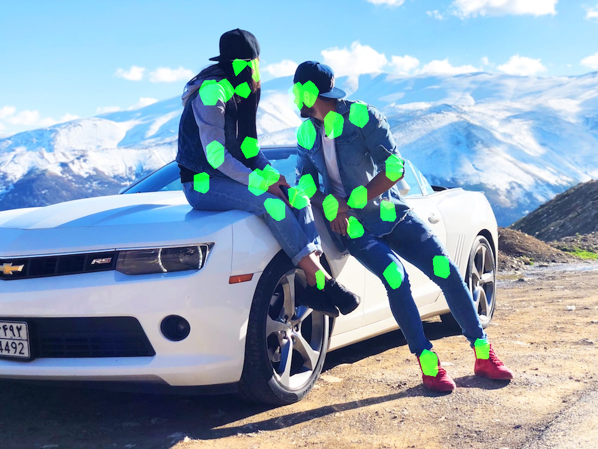
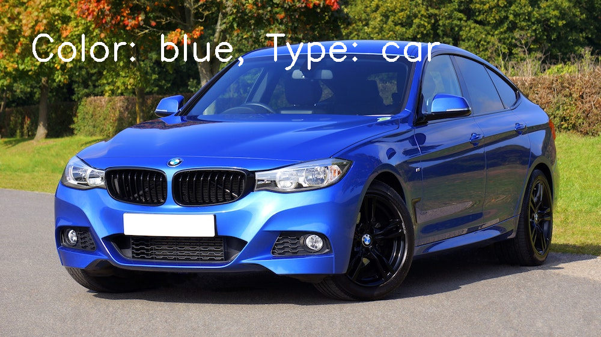

# Edge App for pose estimation, car color and type detection, as well as text detection.






You need to install OpenVINO toolkit for this code.

The code uses the pre-trained models from Intel Edge.The Pre-Trained Models 
available with the OpenVINO toolkit,  

 

## Functions for multi detection

In `handle_models.py`, I implemented `handle_pose`, `handle_text`, and
`handle_car`.

In `app.py`, the input shape of the network is provided to call the `preprocessing`
function. Then, `handle_output` handles the output with the appropriate model argument 
in order to get the right handling function. With that function, I feed the output
of the inference request in order to extract the output. 

Additional post-processing is done in `create_output_image`
within `app.py` to help display the output back onto the input image.

## Testing the apps

To test the app,  use `app.py` to run each edge application, with
the following arguments:
- `-t`: The model type,  which should be one of `"POSE"`, `"TEXT"`, or `"CAR_META"`
- `-m`: The location of the model .xml file
- `-i`: The location of the input image used for testing
- `-c`: A CPU extension file, if applicable. See below for what this is for the workspace.
The results of the output will be saved down for viewing in the `outputs` directory.

As an example, here is an example of running the app with related arguments:

```
python app.py -i "images/blue-car.jpg" -t "CAR_META" -m "models/vehicle-attributes-recognition-barrier-0039.xml" -c "/opt/intel/openvino/deployment_tools/inference_engine/lib/intel64/libcpu_extension_sse4.so"
```

## Model Documentation
Here are the links to the models, the **Output** section to help
understand the models:

- Human Pose Estimation: [human-pose-estimation-0001](https://docs.openvinotoolkit.org/latest/_models_intel_human_pose_estimation_0001_description_human_pose_estimation_0001.html)
- Text Detection: [text-detection-0004](http://docs.openvinotoolkit.org/latest/_models_intel_text_detection_0004_description_text_detection_0004.html)
- Determining Car Type & Color: [vehicle-attributes-recognition-barrier-0039](https://docs.openvinotoolkit.org/latest/_models_intel_vehicle_attributes_recognition_barrier_0039_description_vehicle_attributes_recognition_barrier_0039.html)
